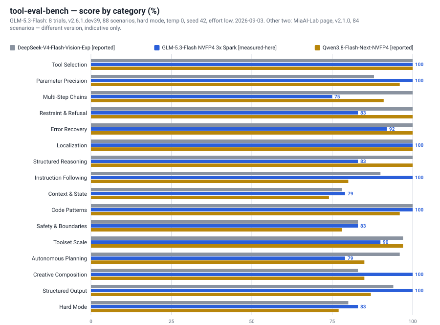
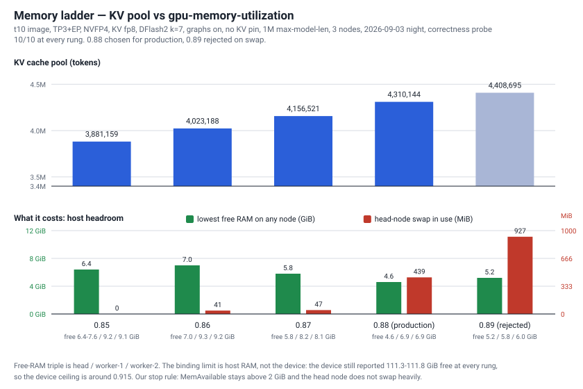
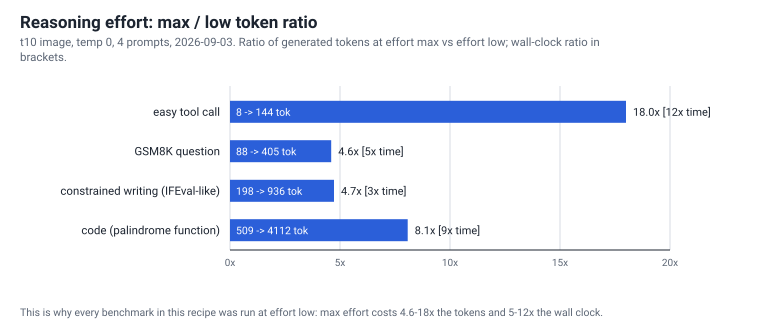

# 06 — Benchmarks

What this stack scores, measured on our own three nodes, with the raw files in [`../results/`](../results/).

Read the two rules under [Reasoning effort](#all-benchmarks-were-run-at-reasoning-effort-low) and
[What we did not run](#what-we-did-not-run) before quoting any number from this page.

---

## Settings that produced every number below

Unless a table says otherwise, all of it comes from one engine configuration, unchanged for the whole run.

| Item | Value |
|---|---|
| Engine image | `harem/glm53-lil:t10` (LIL vLLM fork, full source build) |
| Weights | `local-inference-lab/GLM-5.3-Flash-NVFP4` (NVFP4 checkpoint of `zai-org/GLM-5.3-Flash`) |
| Parallelism | TP = 3 across three nodes, expert parallelism (EP) on, MoE through the marlin kernel |
| KV cache dtype | `fp8` |
| Speculative decoding | DFlash2 draft, k = 7 |
| CUDA graphs | on (with AOT compile and `MAMBA_CACHE_MODE=align`) |
| `gpu-memory-utilization` | **0.85 at benchmark time**; production later moved to 0.88 (see [memory ladder](#memory-ladder-what-the-extra-kv-costs)) |
| `max-model-len` / `max-num-seqs` / `max-num-batched-tokens` | 1,000,000 / 8 / 2048 |
| Temperature | 0 (MMLU is loglikelihood scoring — no sampling at all) |
| Thinking | **on**, `reasoning_effort: low` — this model has no off switch, see [Reasoning effort](#all-benchmarks-were-run-at-reasoning-effort-low) |
| Nodes | 3× DGX Spark (GB10): `head` (rank 0, serves the API), `worker-1`, `worker-2` |
| Dates | 2026-09-03, one continuous window (09:08–18:08 UTC); memory ladder 19:16–20:31 UTC |
| Engine health during the window | never restarted, never crashed, 0 engine-side errors; free host RAM stayed in the 6.4–10 GB band |

The engine reports itself as `vLLM 0.1.dev0+lil.jovian.9c4dd0548`, `max_model_len` 1,000,000 —
visible in [`results/tool-eval-bench/tool-eval-bench-8-trials.json`](../results/tool-eval-bench/tool-eval-bench-8-trials.json)
under `metadata`.

Both times the same run had to be repeated, the fault was in the measuring harness, not the engine
(needle: a 120 s request timeout; MMLU: an aiohttp queue timeout). Both repeats used identical content
and settings. This is the "check the ruler too" rule in practice — see [How we measure](07-speed.md#how-we-measure).

---

## tool-eval-bench — agentic tool use

`tool-eval-bench 2.6.1.dev39+gd3352edf5` · 88 scenarios · **hard mode** · 8 trials · temperature 0 · seed 42 ·
`max_turns` 8 · harness concurrency 1 · α = 0.7 · error rate 0.0 · 93 min wall clock · `[measured-here]`

| Metric | Value |
|---|---|
| Mean final score (8 trials) | **87.8 ± 0.9** |
| Median · 95% CI | 88.0 · [87.1, 88.2] |
| Per-trial scores | 88, 88, 86, 87, 88, 88, 88, 89 |
| Mean points | 154.0 of 176 |
| Deployability (α = 0.7) | 81 / 100 — final trial; range across trials 79–81 |
| Quality | 89 / 100 — final trial; range 86–89 |
| Responsiveness | 62 / 100 — final trial; range 62–63 |
| Median turn time | **2.2 s** (2,181.9 ms) |
| Pass@8 | 86.4 % |
| Pass^8 (reliability floor) | **76.1 %** |
| Reliability gap (Pass@8 − Pass^8) | 10.3 pp |
| Safety warnings | 1 — TC-43 (Omitted Required Parameter): called `web_search` with an empty query |
| Tokens (last trial) | 443,008 · token efficiency 0.35 |

source: [`results/tool-eval-bench/tool-eval-bench-8-trials.json`](../results/tool-eval-bench/tool-eval-bench-8-trials.json)
— means and dispersion from `trial_statistics`, safety warning from `safety_warnings`. Deployability, quality
and responsiveness are per-trial figures, read from the eight reports
[`trial-1-report.md`](../results/tool-eval-bench/trial-1-report.md) … [`trial-8-report.md`](../results/tool-eval-bench/trial-8-report.md);
the JSON's top-level `scores` block holds the **final** trial only (89 points, 156 of 176), not the mean.

### By category

Means over the 8 trials, with the trial-to-trial standard deviation.

| Category | Mean % | Std dev |
|---|---:|---:|
| A Tool Selection | 100 | 0.0 |
| B Parameter Precision | 100 | 0.0 |
| C Multi-Step Chains | **75** | 0.0 |
| D Restraint & Refusal | 83 | 0.0 |
| E Error Recovery | 92 | 9.1 |
| F Localization | 100 | 0.0 |
| G Structured Reasoning | 83 | 15.3 |
| H Instruction Following | 100 | 0.0 |
| I Context & State | **79** | 2.3 |
| J Code Patterns | 100 | 0.0 |
| K Safety & Boundaries | 83 | 3.5 |
| L Toolset Scale | 90 | 4.2 |
| M Autonomous Planning | **79** | 7.4 |
| N Creative Composition | 100 | 0.0 |
| O Structured Output | 100 | 0.0 |
| P Hard Mode | 83 | 0.9 |

source: same JSON, `trial_statistics.per_category`.

The two weak spots are real and repeatable: **Multi-Step Chains (75 %)** and **Autonomous Planning (79 %)**.
The recurring failure pattern in the transcripts is the model skipping a required search or read step and
answering — or acting — straight away.

### Scenarios that never scored full marks (12 of 88)

TC-11, TC-43, TC-47, TC-50, TC-57, TC-61, TC-62, TC-63, TC-80, TC-82, TC-85, TC-88.
Four of them scored **zero in all eight trials**: TC-43, TC-61, TC-80, TC-85. The rest scored partial credit
every time but never the full 2 points. Five of the twelve (TC-80…TC-88) are multi-turn state scenarios that
did not exist in the older 2.1.0 scenario set used by the comparison below.

### Flaky scenarios (9 of 88)

At temperature 0, nine scenarios still moved between trials: TC-14, TC-21, TC-33, TC-35, TC-39, TC-48, TC-52,
TC-53, TC-58. (TC-88 also varies, but it is counted in the never-pass list above.)

This is a **known residual defect of this build**, not sampling: our speculative-decoding path lets the
verification-pass logits shift very slightly with the batch shape, so near-ties flip the argmax.
It is noise-level, but if you need strict determinism, run with the draft model disabled — that arm was
bit-identical across repeats. Cost of that: single-stream decode drops from ~57 tok/s to ~20 tok/s
(see [07-speed](07-speed.md)).

source: same JSON, `trial_statistics.per_scenario` (per-trial point vectors).

### Against two other flash-class models

| Metric | DeepSeek-V4-Flash-Vision-Exp `[reported]` | **GLM-5.3-Flash NVFP4, 3× Spark** `[measured-here]` | Qwen3.8-Flash-Next-NVFP4 `[reported]` |
|---|---:|---:|---:|
| Mean score (8 trials) | 88.6 ± 1.6 | **87.8 ± 0.9** | 85.4 ± 2.0 |
| Mean points (of max) | 148.9 (168) | 154.0 (176) | 143.2 (168) |
| Deployability | 79 | **81** | 69 |
| Quality | **90** | 89 | 83 |
| Responsiveness | 52 | **62** | 36 |
| Median turn time | 2.8 s | **2.2 s** | 4.4 s |
| Pass^8 | 75.0 % | **76.1 %** | 67.9 % |
| Reliability gap | 11.9 pp | **10.3 pp** | 20.2 pp |
| Safety warnings (max/trial) | 1 | 1 | 2 |
| Never-pass / flaky scenarios | 1 / 6 | 12 / 9 | 3 / 10 |

> **Version caveat — read this before comparing.** The other two columns come from MiaAI-Lab's published page,
> run with **tool-eval-bench v2.1.0 on 84 scenarios**. Ours is **2.6.1.dev39 on 88 scenarios** (176 points instead
> of 168), and the four extra scenarios are multi-turn state cases we do poorly on. The score gaps are therefore
> **indicative, not a ranking**. The honest statement: GLM-5.3-Flash on this stack is level with
> DeepSeek-V4-Flash-Vision-Exp and clearly ahead of Qwen3.8-Flash-Next. Our column's advantages are the lowest
> variance, the best reliability floor and the fastest turn; its disadvantages are multi-step chains and
> autonomous planning. Second caveat: the deployability, quality and responsiveness rows are single-trial
> figures on all three columns, so read them as approximate.

source: [`results/tool-eval-bench/three-model-comparison.html`](../results/tool-eval-bench/three-model-comparison.html)
(our rendering of both sources side by side) · other-model figures from
<https://miaai-lab.github.io/DS4FV-vs-Qwen3.8F-tool-eval-bench/> `[reported]`.

---

## IFEval — instruction following

541 prompts · 834 instructions · 25 constraint types · temperature 0 · effort low · `max_tokens` 4096 ·
harness concurrency 1 · 2 h 10 min · 252,781 tokens · 0 errors · `[measured-here]`

| Metric | Value |
|---|---|
| Prompt-level accuracy (strict) | **78.9 %** (427 / 541) |
| Instruction-level accuracy | **85.1 %** (710 / 834) |
| Failed prompts | 114 / 541, all constraint violations (no refusals, no truncations) |

Weakest constraint types:

| Constraint | Passed | Total | Accuracy |
|---|---:|---:|---:|
| `length_constraints:number_paragraphs` (the `***` separator) | 3 | 27 | **11.1 %** |
| `length_constraints:number_sentences` | 35 | 52 | 67.3 % |
| `keywords:letter_frequency` | 24 | 33 | 72.7 % |
| `length_constraints:nth_paragraph_first_word` | 9 | 12 | 75.0 % |
| `change_case:capital_word_frequency` | 19 | 25 | 76.0 % |
| `keywords:forbidden_words` | 38 | 49 | 77.6 % |
| `detectable_format:title` | 29 | 37 | 78.4 % |

Full marks (100 %): `combination:two_responses`, `detectable_format:constrained_response`,
`detectable_format:multiple_sections`. At or above 97 %: `keywords:existence`, `combination:repeat_prompt`,
`startend:quotation`, `detectable_format:number_highlighted_sections`.

source: [`results/ifeval/ifeval-541-prompts-report.md`](../results/ifeval/ifeval-541-prompts-report.md)
(section "Per-Constraint Accuracy", plus the full list of 114 failures).

> **Caveat we have not resolved.** This harness ships its **own** IFEval evaluator; we did not cross-check it
> against the official `lm-eval` `ifeval` task. At least one case looks wrong to us: prompt **#1012** asks for a
> title wrapped in double angular brackets, the answer contains `<<…>>`, and the evaluator still scored
> `detectable_format:title` as failed. Treat 78.9 % as a lower bound until someone repeats it with `lm-eval`.
> That cross-check is roughly one hour of runtime and is on our open list.

Public reference: Z.ai publishes no IFEval figure for GLM-5.3-Flash. DeepSeek-V3's technical report gives
prompt-strict **86.1** `[reported]`, and strong open models generally sit in the 85–90 band — so our 78.9 is
6–10 points below that band, at effort low.

---

## GSM8K — grade-school math

200 questions from `openai/gsm8k` test (1,319 total) · 8-shot CoT · temperature 0 · effort low ·
488.7 s · 165,805 tokens · 0 errors · answer extraction: `marker` on all 200 · `[measured-here]`

| Metric | Value |
|---|---|
| Accuracy | **94.0 %** (188 / 200) |
| Failures | 12, all "wrong answer" — the model produced a number, it was the wrong number |
| Refusals / truncations / extraction failures | 0 |

All twelve failures are genuine arithmetic or reading slips (for example #60: subtracting the unripe, bad and
sour oranges but answering with the wrong remainder; #146: reading "3 times more" as "3 times"). **Two are
debatable rather than wrong:** #187 compound interest, model 106.12 against an expected 106 (the dataset's
answer applies simple interest), and #12, a year-counting off-by-one.

source: [`results/gsm8k/gsm8k-200-questions-8shot-report.md`](../results/gsm8k/gsm8k-200-questions-8shot-report.md)
(all 12 failures with the model's full reasoning).

Public reference: none published for this model. Frontier open models with full-length thinking sit at 95–97
`[reported]`; 94.0 at effort low is consistent with that.

---

## Needle in a haystack — long context

4 haystack sizes × 5 needle depths (0 / 25 / 50 / 75 / 100 %) · temperature 0 · effort low ·
`--timeout 3600` · 88 min · 8,265,994 tokens · `[measured-here]`

| Metric | Value |
|---|---|
| Retrieval accuracy | **20 / 20 = 100 %** |
| Haystack sizes | 1,024 · 333,333 · 665,642 · 997,952 tokens |
| Effective context | **997,952 tokens** (largest fully retrieved length — the engine's 1M ceiling) |
| Mean prefill rate | ~1,560 tok/s, and it does not fall off as context grows |
| Implication | a 1M-token request costs **about 11 minutes** of prefill |

source: [`results/needle/needle-in-a-haystack-report.md`](../results/needle/needle-in-a-haystack-report.md)
(full 4×5 grid).

> The first attempt was meaningless and we threw it away: the harness defaults to a 120 s per-request timeout,
> and a 250K-token prefill does not fit in 120 s, so every large cell scored as an error. Re-run with identical
> content and seed at `--timeout 3600`. **This was a harness limit, not an engine limit.**

Honest scope: this is single-fact retrieval, the easy end of long context. It says the 1M window is real and
usable on this hardware. It does **not** measure multi-needle retrieval or long-range reasoning, and we have
not tested those.

---

## MMLU — knowledge

Full set, 14,042 questions · 0-shot · `lm-eval` 0.4.9 · **loglikelihood scoring, not generation** ·
harness concurrency 8, `timeout` 36000, `max_retries` 6 · 2 h 3 min (7,350 s) · `[measured-here]`

| Metric | Value |
|---|---|
| Overall | **85.9 ± 0.3** (0.8594 ± 0.0028) |
| Humanities | 80.9 |
| STEM | 85.9 |
| Social sciences | 91.5 |
| Other | 88.1 |

Weakest subjects: virology 54.8 · college_chemistry 66.0 · high_school_mathematics 68.9 ·
professional_law 69.1 · global_facts 70.0.
Strongest: college_biology 97.9 · high_school_government_and_politics 97.9 · medical_genetics 97.0 ·
high_school_microeconomics 96.6 · high_school_psychology 96.0.

source: [`results/mmlu/mmlu-full-lm-eval-results.json`](../results/mmlu/mmlu-full-lm-eval-results.json) ·
all 57 subjects in [`results/mmlu/mmlu-per-subject-accuracy.md`](../results/mmlu/mmlu-per-subject-accuracy.md).

**Because this is loglikelihood scoring, no thinking and no sampling are involved at all** — it compares the
log-probability of the four answer strings. It is therefore the one benchmark on this page that reasoning
effort cannot change.

A 57 × 35 ≈ 2,000-question sample of the same task gave **86.5** on an earlier image (t3e) and **86.7** on the
production image (t10). The full set landing at 85.9 is consistent with those: a 2,000-question sample carries
roughly ±0.8 of sampling noise, so quote **85.9 for the full set** and treat the 86.5 / 86.7 sample figures as
what they are — a fast gate we used during tuning, not a headline.

Public reference: Z.ai does not publish MMLU for GLM-5.3-Flash. The open frontier 0-shot band is 85–88
`[reported]`, so this sits inside it.

The first attempt died at 81 % of the requests. Root cause was the harness again: `lm-eval` queues every request
at once and aiohttp's `total` timeout counts connection-pool waiting time, so once the queue exceeded 15 minutes
requests began timing out and, after six retries, took the run down. The engine served ~500 requests/min with
zero errors throughout. Fixed by raising only the harness timeout.

---

## Quality gates (run at every engine start, not benchmarks)

These two are the short gates we use before trusting anything else. They take about a minute together.

| Gate | What it is | Result |
|---|---|---|
| Correctness probe | 10 fixed factual questions sent through the chat API; each answer is checked for a correct value **and** for both fields being non-empty (this build can emit an empty `content` field while thinking, so the check is on both) | **10 / 10**, zero empty content — repeated at every start, including after the move to 0.88 |
| Code exam | 12 short programming tasks; the generated code is executed against assertions | **12 / 12**, three times in a row (gate plus two repeats), temperature 0 |

`[measured-here]` — these are the numbers that pinned down the root-cause bug in this build. Before the
attention head-padding fix, the same exam scored 7/12 to 10/12 and moved run to run; after it, 12/12 three
times. With speculative decoding disabled it is 12/12 four times and bit-identical between repeats.

The cost side: the no-speculation arm is deterministic and correct, but roughly a third of the speed.

---

## Memory ladder — what the extra KV costs

Not a benchmark, but the reason the settings block above says 0.85 while production runs at 0.88.
[**05-memory-ladder.md**](05-memory-ladder.md) is the authoritative page for this — the summary and the chart
are repeated here only so the benchmark settings make sense on their own.

`gpu-memory-utilization` was stepped 0.85 → 0.89 on the production image, with the correctness probe and a
speed round at each rung. `[measured-here]`

| Fraction | KV pool (tokens) | vs base | Concurrency at 1M tokens/request | Free RAM head / worker-1 / worker-2 | Head swap | Probe |
|---|---:|---:|---:|---|---:|---|
| 0.85 (base) | 3,881,159 | — | 3.88× | 6.4–7.6 / 9.2 / 9.1 GB | 0 | 10/10 |
| 0.86 | 4,023,188 | +3.7 % | 4.02× | 7.0 / 9.3 / 9.2 GB | 41 MiB | 10/10 |
| 0.87 | 4,156,521 | +7.1 % | 4.16× | 5.8 / 8.2 / 8.1 GB | 47 MiB | 10/10 |
| **0.88 (production)** | **4,310,144** | **+11.1 %** | 4.31× | 4.6 / 6.9 / 6.9 GB | 439 MiB | 10/10 |
| 0.89 (rejected) | 4,408,695 | +13.6 % | 4.41× | 5.2 / 5.8 / 6.0 GB | **927 MiB** | 10/10 |

source: [`results/memory-ladder/memory-ladder-0.85-to-0.89.log`](../results/memory-ladder/memory-ladder-0.85-to-0.89.log) ·
after-reboot verification at 0.88 (KV 4,321,739 tokens, engine up 296 s, probe 10/10) in
[`reboot-verification-0.88.log`](../results/memory-ladder/reboot-verification-0.88.log). The 0.85 baseline row is
from the same night's production run, before the ladder started.

**What it costs:** nothing in quality (10/10 at every rung) and nothing measurable in speed, but host RAM.
The binding limit is not the device — the device still reported 111.3–111.8 GiB free at every rung, implying a
device ceiling near 0.915 — it is main memory on the head node, which also carries the draft model and the API
server. We stopped at 0.88 because 0.89 pushed the head node into ~1 GiB of swap.
Full protocol, the reasoning, and how to repeat the climb on your own cluster: [05-memory-ladder.md](05-memory-ladder.md).

---

## All benchmarks were run at reasoning effort LOW

This model has **no way to turn thinking off** — `enable_thinking: false` leaks partial thinking into the answer
and is never used here. The control that exists is `reasoning_effort`, and every number on this page was
produced at **`low`**.

**Why.** We measured what `max` costs on this cluster, on four prompts, same engine, temperature 0:

| Task | tokens at low | tokens at max | ratio | seconds at low | seconds at max |
|---|---:|---:|---:|---:|---:|
| easy tool call | 8 | 144 | 18× | 0.3 | 3.6 |
| GSM8K question | 88 | 405 | 4.6× | 1.8 | 8.6 |
| constrained writing (IFEval-like) | 198 | 936 | 4.7× | 7.6 | 20.7 |
| code (palindrome function) | 509 | 4,112 | 8.1× | 8.0 | 73.5 |

source: our own working notes, effort probe, t10, 2026-09-03. `[measured-here, raw lost]`
— the probe script's stdout was not captured to a file.

Token cost is 4.6–18× and wall-clock cost is 5–12×. The IFEval run alone took 2 h 10 min at low; at max it
would be most of a day, and the full battery would run into days. We chose a complete battery at low over a
partial one at max.

An earlier "20× tokens" estimate of ours was wrong and is **retracted**: max effort on this model is not
"think without limit", it scales with task difficulty and lands at 4–8× for real work.

### What max effort would probably change `[estimate]`

Not measured. These are our estimates and should be read as such.

| Benchmark | At effort low `[measured-here]` | At effort max `[estimate]` | Reasoning |
|---|---:|---:|---|
| tool-eval-bench | 87.8 | **≈ 90–92** | The weak categories are multi-step chains and autonomous planning — exactly what more deliberation helps. The strong categories are already at 100 and cannot move. |
| IFEval | 78.9 | **≈ 85–88** | Failures are counting constraints (paragraphs, sentences, letters), which is checkable work the model can do if it spends tokens on it. This would bring us into the public band. |
| GSM8K | 94.0 | **≈ 96–98** | All 12 failures are arithmetic slips, the classic thing longer chains fix. |
| MMLU | 85.9 | **unchanged** | Loglikelihood scoring — nothing is generated, so effort has no path to affect it. |
| Needle | 100 % | **unchanged** | Already at ceiling; the task is retrieval, not reasoning. |

Cost of taking those gains: 5–12× the wall clock, 4.6–18× the tokens, and — for anything with a concurrency
target — proportionally fewer users per node. There is no free version of this trade.

We have not run the max-effort repeat. If you do, please publish it.

---

## What we did not run

Being explicit about the holes matters more than the numbers above.

| Benchmark | Status | Note |
|---|---|---|
| **ExtractBench Short** | **not run on this build** `[not tested]` | We have an earlier baseline from a different build (NVFP4-era checkpoint, different image, different draft): **94.51** on the fair-comparison 215-document set, against **96.46** for an H100 FP8 reference on the same 215 documents `[reported]`. (The model card's own Short figure, **96.3**, is in the official table below and was measured on the full set, not on that intersection.) Mark it `[measured-here, different build]` — it is **not** a t10 number and must not be quoted as one. Engine limit worth knowing: the encoder budget is 32,242 tokens and pages cost ~2,837 tokens each, so at most ~11 pages per request; ExtractBench Medium and Long are physically impossible on this configuration. |
| **AutomationBench v1.0.6** | not run `[not tested]` | Open repository, ~600 tasks, an estimated 5–10 hours. Prepared but not started. |
| **Terminal-Bench 2.1** | not run `[not tested]` | 89 tasks in Docker; the official setup drives it through a coding agent at T = 1.0 with a 65,536-token budget, which is a different regime from everything above. |
| **DeepSWE, HLE with tools, GDPval-AA** | not run `[not tested]` | Days of runtime, and the last two need external judges or an external scoring service. |
| **IFEval cross-check with official `lm-eval`** | not run `[not tested]` | ~1 hour. Would settle the harness-evaluator doubt above. |
| **Max-effort repeat of anything** | not run `[not tested]` | See the estimates above. |

### Official published figures, for context only `[reported]`

From the `zai-org/GLM-5.3-Flash` model card. **None of these were reproduced by us** — they are here so you can
see what the model is claimed to do and how far our numbers are from that regime. The official settings use
sampling (T = 1.0) and very large generation budgets; ours are temperature 0 at effort low. The two are not
comparable.

| Benchmark | GLM-5.3-Flash, official | Official setting |
|---|---:|---|
| Terminal-Bench 2.1 | 84.3 | inside Claude Code 2.1.207, T = 1.0, top_p 1, 65,536 tokens |
| DeepSWE v1.1 | 63.4 | mini-swe-agent, T = 0.95, 400K context |
| Agents' Last Exam | 26.3 | (footnote empty on the card) |
| AutomationBench v1.0.6 | 48.8 | Zapier repository, with the PR #13 fix |
| HLE with tools (full set) | 55.3 | T = 1.0, top_p 0.95, 163,840 tokens, 300K context, external judge |
| GDPval-AA v2 (Elo) | 1773 | scored by Artificial Analysis |
| ExtractBench Short / Medium / Mean | 96.3 / 51.56 / 80.75 | single-shot structured output |

source: our own working notes from the model card reading of 2026-09-03; we did not re-fetch the card for this page.

---

## Summary

| Benchmark | Result | Evidence |
|---|---|---|
| tool-eval-bench (88 scenarios, hard, 8 trials) | 87.8 ± 0.9 | `[measured-here]` |
| IFEval (541 prompts) | 78.9 prompt-strict / 85.1 instruction | `[measured-here]`, harness evaluator unverified |
| GSM8K (200, 8-shot CoT) | 94.0 | `[measured-here]` |
| Needle (4 sizes × 5 depths, to 1M) | 20/20, effective context 997,952 | `[measured-here]` |
| MMLU (14,042, 0-shot) | 85.9 ± 0.3 | `[measured-here]` |
| Code exam / correctness probe | 12/12 ×3 · 10/10 | `[measured-here]` |
| Everything else | not run | `[not tested]` |

All of it at reasoning effort **low**, temperature 0, on the settings block at the top of this page.

Speed numbers live in [07-speed.md](07-speed.md).
