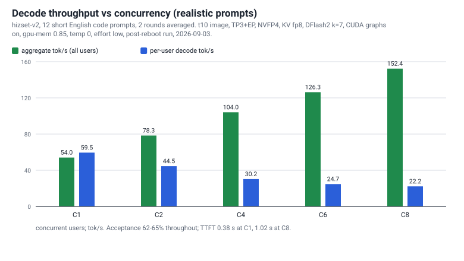

# 07 — Speed

Three sections, deliberately kept apart:

1. [**Realistic**](#a-realistic--what-you-will-actually-see) — short code prompts and mixed-category prompts. This is what you get.
2. [**Synthetic**](#b-synthetic--the-speculative-decoding-ceiling) — the community protocol prompts. This is the ceiling, and it will disappoint you in real use.
3. [**What moves speed**](#c-what-moves-speed) — the levers, each with what it costs.

Do not mix numbers between sections 1 and 2. The gap between them is 1.6× and it is entirely an artefact of how
predictable the text is.

---

## Settings behind every number here

| Item | Value |
|---|---|
| Engine image | `harem/glm53-lil:t10` |
| Weights | `local-inference-lab/GLM-5.3-Flash-NVFP4` |
| Parallelism | TP = 3, EP on, MoE marlin |
| KV dtype | `fp8` |
| Speculative decoding | DFlash2 draft, k = 7 (unless a row says "no draft") |
| CUDA graphs | on, with AOT compile and `MAMBA_CACHE_MODE=align` (unless a row says otherwise) |
| `gpu-memory-utilization` | stated per table: 0.85 for the sweeps, 0.88 for the category runs |
| `max-model-len` / `max-num-seqs` / `max-num-batched-tokens` | 1,000,000 / 8 / 2048 |
| Temperature | 0 |
| Thinking | on, `reasoning_effort: low` |
| `max_tokens` | 256 per request in the concurrency sweep, 700 in the cold/warm and category probes, 400 in the synthetic protocol |
| Nodes | 3× DGX Spark (GB10): `head` (rank 0, serves the API), `worker-1`, `worker-2` |
| Date | 2026-09-03 |

**Prompt language matters here, so read this first.** The 12-prompt concurrency set (hizset-v2) is English.
Two other prompt sets were not, at the time of measurement: the cold/warm single-stream probe used a Turkish
phrasing of its task, and three of the six prose category prompts were non-English. On the identical engine,
the same task asked in English decodes **10–15 tok/s faster with about 13 points more draft acceptance** —
measured, see [prompt language](#prompt-language). Every Turkish-prompt table below is therefore a **floor**
for an English workload, not a ceiling. Tables are labelled.

---

## (a) REALISTIC — what you will actually see

### Concurrency sweep (hizset-v2: 12 short English code prompts)

Two rounds, same session, same settings. `per-user` is what one user feels; `aggregate` is what the box
delivers in total. Best rows are the post-reboot run, which is the cleanest state this cluster reaches.

**Post-reboot production run — `[measured-here]`, gpu-mem 0.85, graphs on, k = 7**

| Concurrency | per-user decode tok/s (run 1 / run 2) | aggregate tok/s (run 1 / run 2) | median TTFT | acceptance |
|---|---|---|---:|---:|
| C1 | **59.6 / 59.4** | 53.8 / 54.3 | 0.39 s | 63–64 % |
| C2 | 44.5 / 44.5 | 76.8 / 79.9 | 0.55 s | 64–65 % |
| C4 | 29.1 / 31.4 | 103.2 / 104.9 | 0.77 s | 62–65 % |
| C6 | 25.2 / 24.2 | 125.8 / 126.7 | 0.94 s | 63–64 % |
| C8 | 22.3 / 22.0 | **152.8 / 152.0** | 1.02 s | 63 % |

source: [`results/speed/bench-sweep-reboot-t10-1.json`](../results/speed/bench-sweep-reboot-t10-1.json),
[`-2.json`](../results/speed/bench-sweep-reboot-t10-2.json)

**Same image, same settings, earlier in the session (a warm but busier machine) — `[measured-here]`**

| Concurrency | per-user decode tok/s | aggregate tok/s | median TTFT | acceptance |
|---|---|---|---:|---:|
| C1 | 56.9 / 56.5 | 51.6 / 51.3 | 0.41 s | 65 % |
| C2 | 42.7 / 39.5 | 73.8 / 71.5 | 0.59 s | 63–64 % |
| C4 | 29.5 / 28.8 | 97.2 / 98.7 | 0.81 s | 63–65 % |
| C6 | 22.9 / 22.8 | 116.6 / 119.4 | 0.99 s | 62 % |
| C8 | 21.8 / 21.3 | 145.8 / 145.9 | 1.07 s | 63 % |

source: [`results/speed/bench-sweep-lil-t10-1.json`](../results/speed/bench-sweep-lil-t10-1.json),
[`-2.json`](../results/speed/bench-sweep-lil-t10-2.json)

The ~5 % spread between these two tables at identical settings is the honest run-to-run variance of this
cluster. Quote the range, not a single decimal.

At C1 the aggregate figure is *below* the per-user figure. That is not a typo: aggregate includes prefill and
the gaps between the eight sequential requests, while per-user decode measures only the decode phase. See
[How we measure](#how-we-measure).

### Cold versus warm, single stream

Same prompt three times: first request cold (kernels not yet resident), then two warm.
**These four rows used the Turkish phrasing of the task** — see the English comparison directly below.

| Rung | cold | warm | warm again | acceptance |
|---|---:|---:|---:|---:|
| 0.86 | 41.7 | 45.5 | 44.1 | 41–46 % |
| 0.87 | 45.1 | 43.9 | 46.0 | 45–48 % |
| 0.88 (production) | 43.0 | 43.0 | 45.1 | 44–47 % |
| 0.89 | 43.5 | 42.6 | 42.8 | 45–46 % |

source: [`results/memory-ladder/memory-ladder-0.85-to-0.89.log`](../results/memory-ladder/memory-ladder-0.85-to-0.89.log)
(the `C1 cold/warm` blocks), 700 tokens per request

**The same probe, same engine, the task written in English** (gpu-mem 0.88, three runs of three requests,
2026-09-04) — `[measured-here]`

| | cold | warm | warm again |
|---|---|---|---|
| run 1 | 54.7 tok/s, 58.4 % | 53.8, 57.3 % | 60.4, 63.8 % |
| run 2 | 63.2, 68.6 % | 60.0, 65.1 % | 56.5, 59.6 % |
| run 3 | 56.6, 60.7 % | 57.1, 60.0 % | 55.0, 58.8 % |

Range: decode **53.8–63.2 tok/s**, acceptance **57.3–68.6 %**.

source: [`results/speed/cold-warm-c1-english-prompt.txt`](../results/speed/cold-warm-c1-english-prompt.txt)

Three things to take from this. First, the cold penalty on an already-serving machine is small — a few
percent, gone by the second request. (A genuinely cold first request right after engine start is slower than
any row here.) Second, the Turkish rows (41–46 tok/s) are **lower than the 56–60 tok/s in the sweep above**
and the English rows are not: the sweep prompts were English all along. Third, and the general lesson:
prompt content — including its language — moves single-stream speed more than any engine flag in this recipe.

### By content type

Four categories, six prompts each, warm engine. This is the single most useful table on this page.

**Production configuration (gpu-mem 0.88, graphs on) — `[measured-here]`**

| Category | C1 decode tok/s (min–max) | C1 TTFT | C1 acceptance | C4 per-user | C4 aggregate | C4 acceptance |
|---|---|---:|---:|---:|---:|---:|
| prose | 21.2 (17.3–25.8) | 0.32 s | **13.1 %** | 10.7 | 36.6 | 10.7 % |
| code (Py / Rust / Go / TS) | 46.2 (37.4–57.9) | 0.44 s | 47.8 % | 26.6 | 78.7 | 49.9 % |
| math | 56.5 (43.3–77.6) | 0.57 s | 54.7 % | 33.2 | 81.1 | 56.2 % |
| structured JSON | 53.8 (45.8–62.8) | 0.49 s | 55.5 % | 32.2 | 80.1\* | 52.2 % |

\* single reading; this cell reads 89–91 in every other run of the same test — treat 80.1 as noise, not a finding.

source: [`results/memory-ladder/memory-ladder-0.85-to-0.89.log`](../results/memory-ladder/memory-ladder-0.85-to-0.89.log)
(`category C1+C4` block at the 0.88 rung)

**Independent cross-check on a graphs-limited image (gpu-mem 0.85) — `[measured-here]`**

| Category | C1 decode tok/s (min–max) | C1 acceptance | C4 per-user | C4 aggregate | C4 acceptance |
|---|---|---:|---:|---:|---:|
| prose | 20.6 (16.6–24.6) | **13.3 %** | 10.8 | 37.5 | 11.3 % |
| code | 43.0 (30.9–56.3) | 44.2 % | 26.6 | 78.3 | 49.7 % |
| math | 57.0 (47.0–74.7) | 60.3 % | 34.1 | 79.9 | 57.2 % |
| structured JSON | 52.1 (42.3–59.0) | 55.3 % | 32.2 | 90.4 | 57.5 % |

source: [`results/speed/category-speed-c1-c4.log`](../results/speed/category-speed-c1-c4.log)

**The finding.** The DFlash2 draft barely holds on prose — **~13 % acceptance** — and single-stream speed
collapses to roughly the no-draft level (20.4 tok/s, measured with the draft disabled). On code, math and JSON
acceptance is 44–60 % and the draft is worth 2–2.8×. If your workload is prose, budget for ~21 tok/s per user,
not 57.

**One cause is now known, the rest are not.** Three of the six prose prompts were not in English at
measurement time, and prompt language alone is worth roughly 13 points of acceptance on this stack (see
[prompt language](#prompt-language)) — so part of the 13 % prose figure is a language effect, not a
prose effect. The remaining plausible causes we have **not** separated: the draft model's training mix (code
and math heavy) and the inherent unpredictability of creative text. Read the prose row as
"prose-like, mixed-language, a floor" until somebody re-runs it with an all-English prose set. `[not tested]`

### Prefill

| Case | Rate | Note |
|---|---:|---|
| 7K-token prompt, cache cold | **1,585 tok/s** | `[measured-here, raw lost]` — the run-chain stdout was not kept as a file |
| Long-context average across 8.27M tokens of haystack | **~1,560 tok/s** | `[measured-here]`, does not degrade as context grows — see [06-benchmarks](06-benchmarks.md#needle-in-a-haystack--long-context) |
| A 1,000,000-token request | **≈ 11 minutes** of prefill | arithmetic from the line above |
| 7K prompt, prefill and decode mixed in one request | TTFT 4.8 s | `[measured-here, raw lost]`; decode during the mixed phase was 6.5 tok/s on the predecessor image (t3e), not re-measured on t10 |

---

## (b) SYNTHETIC — the speculative-decoding ceiling

> **Read this before quoting anything in this section.** These three prompts are the community protocol used
> for cross-hardware comparisons (count from 1 to 200; write 50 near-identical `clamp_XX` functions; a hash-map
> explanation in prose). They are highly predictable text, so the draft model is accepted almost every time and
> the numbers go up by more than half. **They are a ceiling, not a forecast. Real work will not feel like this.**
> The section above is what your users will experience.

`[measured-here]` · post-reboot run · temperature 0 · 400 tokens · one warm-up plus three timed runs · median reported

| Synthetic prompt | Decode tok/s | Draft acceptance |
|---|---:|---:|
| count 1 → 200 (structured) | **92.8** | 94 % |
| 50 × `clamp_XX` functions (code pattern) | **83.2** | 100 % |
| hash-map explanation (prose) | 28.3 | 24 % |

source: vault-derived from the post-reboot verification run of 2026-09-03; the same run's concurrency sweep is
in [`results/speed/bench-sweep-reboot-t10-1.json`](../results/speed/bench-sweep-reboot-t10-1.json).
`[measured-here, raw lost]` for the three synthetic lines — the protocol script prints to stdout only.

Side-by-side with the realistic numbers from section (a), same engine, same session:

| Prompt type | Decode tok/s | Acceptance |
|---|---:|---:|
| synthetic structured (count to 200) | 92.8 | 94 % |
| synthetic code pattern (`clamp_XX`) | 83.2 | 100 % |
| realistic math | 56.5 | 55 % |
| realistic structured JSON | 53.8 | 56 % |
| realistic code | 46.2 | 48 % |
| synthetic prose (hash-map) | 28.3 | 24 % |
| realistic prose | 21.2 | 13 % |

Even the synthetic prose prompt only reaches 28.3 tok/s. **Acceptance is the whole story**, and acceptance is a
property of the text, not of your configuration.

---

## (c) What moves speed

### Acceptance rate, i.e. content

The dominant factor by a wide margin: 13 % acceptance on prose against 94–100 % on synthetic patterns, a 4.4×
spread in single-stream tok/s from the same engine. No flag in this recipe comes close to that.
**Cost of the draft model:** it eats KV pool, and it is the source of the near-tie flipping described in
[06-benchmarks](06-benchmarks.md#flaky-scenarios-9-of-88). Disabling it (same session, same day) costs about
two thirds of the speed — C1 56.9 → 20.4 tok/s, C8 aggregate 145.8 → 74.6 tok/s — and buys back
**+54 % KV pool** (3,860,869 → 5,934,911 tokens) plus bit-exact determinism between repeats.
source: [`results/speed/bench-sweep-lil-t9-1.json`](../results/speed/bench-sweep-lil-t9-1.json), `-2.json` (no-draft arm)

### Prompt language

A special case of the above, and a large one. The identical task, identical engine, identical settings:

| Prompt language | C1 decode | acceptance |
|---|---:|---:|
| Turkish | 41–47 tok/s | 41–48 % |
| English | 53.8–63.2 tok/s | 57.3–68.6 % |

source: [`results/memory-ladder/memory-ladder-0.85-to-0.89.log`](../results/memory-ladder/memory-ladder-0.85-to-0.89.log)
(Turkish) and [`results/speed/cold-warm-c1-english-prompt.txt`](../results/speed/cold-warm-c1-english-prompt.txt)
(English, 2026-09-04) · `[measured-here]`

The DFlash2 drafter predicts English continuations considerably better. Nothing in the engine changed between
the two sets. **We did not investigate further** and we have not repeated the whole battery in English, so if
your workload is English, treat every Turkish-prompt table on this page as a floor. If your workload is a
language the drafter handles poorly, expect the draft to stop earning its KV cost and consider the no-draft
arm. `[not tested]` for any language other than these two.

### Concurrency

Per-user speed falls and total throughput rises, smoothly, with no cliff up to C8 (our `max-num-seqs`):
59.6 → 22.3 tok/s per user, 53.8 → 152.8 tok/s aggregate. TTFT goes 0.39 s → 1.02 s. Acceptance is flat across
the whole range, which is the useful part: the draft keeps working under load.
**Cost:** nothing beyond the arithmetic — C8 gives 2.8× the total tokens for 0.37× the per-user speed.

### CUDA graphs

| Arm | C1 per-user | C4 per-user | C6 per-user | C8 aggregate | KV pool |
|---|---:|---:|---:|---:|---:|
| graphs on (production) | **56.9 / 56.5** | 29.5 / 28.8 | 22.9 / 22.8 | 145.8 / 145.9 | 3,860,869 |
| graphs off (eager) | 47.1 / 45.8 | **30.5 / 30.9** | **24.1 / 24.5** | 155.0 / 145.6 | **4,365,217** |
| graphs captured only at sizes 8 and 16 | 56.1 | 29.1 / 30.5 | 23.6 | 147.6 | 4,063,768 |

source: [`bench-sweep-lil-t10-{1,2}.json`](../results/speed/bench-sweep-lil-t10-1.json) ·
[`bench-sweep-lil-t16-{1,2}.json`](../results/speed/bench-sweep-lil-t16-1.json) ·
[`bench-sweep-lil-t17-{1,2}.json`](../results/speed/bench-sweep-lil-t17-1.json) · KV pool sizes are vault-derived
from the engine's own startup line in each arm

**Cost:** graphs buy +22 % single-stream and give back 5 % at C4–C6, nothing at C8, and **−12 % KV pool**.
Capturing only sizes 8 and 16 keeps almost all of the C1 gain for a −7 % KV pool instead of −12 %. If you run
6–8 concurrent agents and want context, eager is defensible; we kept graphs on because interactive
single-stream latency mattered more to us, and then recovered the KV by raising `gpu-memory-utilization`
(see [06-benchmarks](06-benchmarks.md#memory-ladder--what-the-extra-kv-costs)).

### Temperature: nearly irrelevant

Single stream, warm, effort low, two prompts per cell:

| Setting | code | JSON | prose |
|---|---:|---:|---:|
| T = 0 | 55.7 | 56.5 | 23.3 |
| T = 0.6, top_p 0.95 | 55.9 | 59.9 | 23.8 |
| T = 1.0, top_p 0.95 | 52.9 | 58.4 | 22.4 |

source: vault-derived, `DUSUNME-VE-EFOR-URETIM-AYARI` sampling probe. `[measured-here, raw lost]`

Within ±5 %, which is our run-to-run noise. Sampling temperature is not a speed knob on this stack — pick it
for output quality. (The model card recommends T = 1.0, top_p 0.95.)

### Turning thinking on costs nothing

Same engine, thinking on versus off in the request: C1 28.94 vs 28.91 tok/s, C8 94.04 vs 97.11 tok/s.
`[measured-here, raw lost]` What thinking costs is **tokens**, not tokens per second — and that is
[the effort question](06-benchmarks.md#all-benchmarks-were-run-at-reasoning-effort-low), not a speed question.

### Cold versus warm

First request after start is a few percent slower; by the second request it is gone. A full engine start takes
about 4–5 minutes on a warm machine, and 296 s from `reboot` to a serving endpoint via the systemd unit.
source: [`results/memory-ladder/reboot-verification-0.88.log`](../results/memory-ladder/reboot-verification-0.88.log)

### The C1 variance note

Single-stream decode is the noisiest number we publish: 56.5–59.6 tok/s for the same image and settings,
depending on how long the machine has been up and what else touched it. Treat C1 as a **range**. Aggregate
throughput at C4 and above is much steadier (±2 %).

---

## How we measure

Everything above follows the same rules. They exist because we have been burned by each of them.

**Decode rate.** `decode tok/s = (tokens − 1) / (end − first token)`. The first token is excluded so that
prefill and queueing do not contaminate the decode figure. Token counts come from the **server's** usage
accounting, not from our own tokenizer — the two disagree, and the server is the one that did the work.
This is also why `aggregate` can be lower than `per-user` at C1: aggregate is total output tokens over total
wall clock including prefill and inter-request gaps, per-user is decode only.

**Acceptance.** Read from the engine's `/metrics` endpoint as the difference between
`spec_decode_num_draft_tokens_total` and `spec_decode_num_accepted_tokens_total` across the run, not estimated
from output. `accept_len` in the raw JSON is the mean number of tokens produced per model step.

**Two rounds, always.** Every sweep runs twice and both rounds are published. A single reading is not a
measurement — see the `80.1` cell in the category table, which is 89–91 in every other run.

**A/B in one session.** When comparing two settings, both arms run on the same day, same prompts, same script,
same machine state. Configuration files are never copied between nodes — they are derived with `sed` from the
node's own file, because a copied file silently carries the wrong host identity.

**Prefix-cache artefact.** Repeating the same prompt in the same session can be served partly from the prefix
cache and will read far too fast. We checked this explicitly: disabling the prefix cache changed neither
acceptance nor quality, so it is not distorting the numbers here — but if you re-run these scripts, vary the
prompts or clear the cache between arms.

**Validate the ruler.** Twice on this project the measuring tool, not the engine, produced the anomaly: the
needle harness's 120 s request timeout and `lm-eval`'s aiohttp queue timeout. Both were caught because the
engine's own logs showed zero errors while the harness reported failures. `lm-eval` itself was verified against
a known-good task on 2026-09-02 before any of its numbers were used. Before you believe a surprising
measurement, confirm the instrument.

**One number, two sources.** A figure only becomes a planning input if two independent readings agree.
Anything below that threshold is written here with its range or marked `[estimate]`.

---

## Summary

| Question | Answer | Section |
|---|---|---|
| One user, English code prompt | 46–60 tok/s | [(a)](#a-realistic--what-you-will-actually-see) |
| One user, prose | ~21 tok/s (mixed-language prompt set — a floor) | [(a)](#by-content-type) |
| Eight users, total | ~153 tok/s (22 per user) | [(a)](#concurrency-sweep-hizset-v2-12-short-english-code-prompts) |
| Time to first token | 0.39 s at C1, 1.02 s at C8 | [(a)](#concurrency-sweep-hizset-v2-12-short-english-code-prompts) |
| Prefill | ~1,560–1,585 tok/s; a 1M-token request ≈ 11 min | [(a)](#prefill) |
| Best synthetic number | 92.8 tok/s | [(b)](#b-synthetic--the-speculative-decoding-ceiling) — ceiling, not a forecast |
| Biggest lever | draft acceptance — what kind of text you are generating, and in which language | [(c)](#acceptance-rate-ie-content) |

Benchmark scores are in [06-benchmarks.md](06-benchmarks.md).
